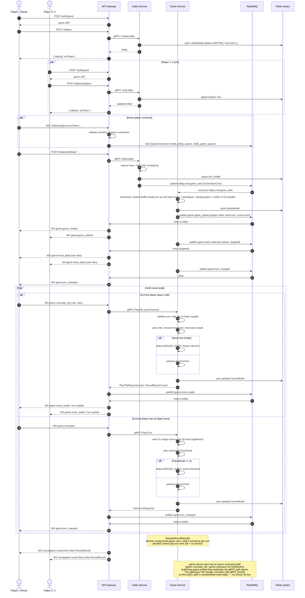

# Game lifecycle — sequence diagram

Full flow from lobby creation to game finish, as actually wired today: lobby lifecycle is plain REST through the API gateway, gameplay is a JWT-gated per-lobby WebSocket, and services talk to each other over RabbitMQ. Redis is the state store for lobby/game aggregates, not a message transport.

## Key references
- `services/api-gateway/http.go`, `services/api-gateway/ws.go`
- `services/lobby-service/internal/service/lobby.go`
- `services/lobby-service/internal/infrastructure/grpc/grpc_handler.go`
- `services/lobby-service/internal/infrastructure/events/lobby_publisher.go`
- `services/game-service/internal/domain/game.go`
- `services/game-service/internal/service/game.go`
- `services/game-service/internal/infrastructure/grpc/grpc_handler.go`
- `services/game-service/internal/infrastructure/events/game_consumer.go`
- `shared/contracts/events.go`
- `shared/messaging/{events.go,queue_consumer.go,connection_manager.go}`
